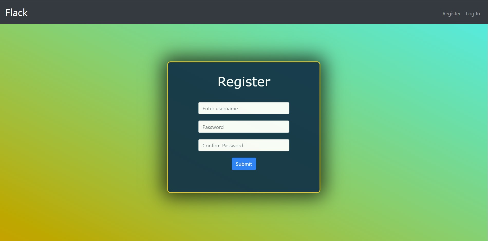

# Flack Messaging App

A messaging application based on using open chatrooms wherein users can create and freely join chatrooms to converse with others in real time, through a simple and intuitive user-interface. This web application is built with Python and Flask.

Website hosted with Heroku on: https://flack-messaging-app-v2.herokuapp.com/

## Built With
* **Flask Web Framework and Sessions** used for server-side management
* **Jinja 2** for HTML templating
* **SocketIO** used for broadcasting and receiving messages in real time and save the message data
* **Bootstrap 4** used for styling web pages, along with custom **CSS** code
* **Javascript** used for creating dynamic chatrooms with the following functionality:
  * **Handlebars** used to dynamically create new chatbubbles when new messages are received
  * **SocketIO** to send and receive messages
  * Other functionality such as pressing enter key to send messages, enabling submit button only when there is content in the message, scrolling down to newest message when received, and more

## Features
* Sign In and Registration of users
* Open chatrooms that users can join for real-time messaging
* Identification of all recent chats for a user
* Storage of the 100 most recent messages in each chatroom
* For each message the following is stored: content, timestamp, author

## Setup and Usage
Please access the link above for the website hosted on Heroku.
Alternatively, to use a local copy simply clone and run application.py

## Screenshots for Demo

  
  
  

